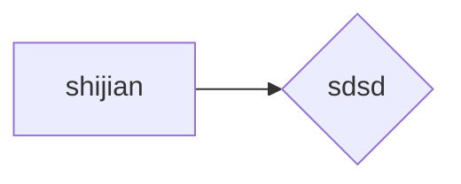

# [链接](https://leetcode.cn/problems/generate-parentheses)
数字 n 代表生成括号的对数，请你设计一个函数，用于能够生成所有可能的并且 有效的 括号组合。

 

示例 1：

输入：n = 3
输出：["((()))","(()())","(())()","()(())","()()()"]

示例 2：

输入：n = 1
输出：["()"]

来源：力扣（LeetCode）

著作权归领扣网络所有。商业转载请联系官方授权，非商业转载请注明出处。

# 解题
就是上面的cpp文件，思路就是深度优先加回溯，两个递归，指数级时间复杂度，两重递归大概很难去递归。

|shijian|kongjian|
|--|--|
|+666|666|

