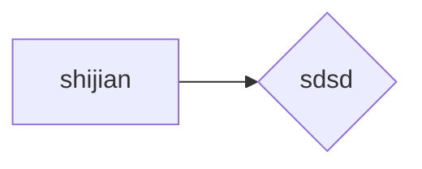

# <font color=royalblue>[链接](https://leetcode.cn/problems/generate-parentheses)</font>
数字 n 代表生成括号的对数，请你设计一个函数，用于能够生成所有可能的并且 有效的 括号组合。

 

示例 1：

输入：n = 3
输出：["((()))","(()())","(())()","()(())","()()()"]

示例 2：

输入：n = 1
输出：["()"]

来源：力扣（LeetCode）

著作权归领扣网络所有。商业转载请联系官方授权，非商业转载请注明出处。

# <font color=chocolate>解题</font>
就是上面的cpp文件，思路就是深度优先加回溯，两个递归，指数级时间复杂度，两重递归大概很难去递归。事实上，对于dfs和回溯，我应该有所了解了
dfs就是一直往下，回溯就是push 递归（满足条件就return) 在pop，完成回溯，有时候其实没有显式的push或者pop，
```c++
vector<string> ret;
void op(int n,string now,int sul,int sur)
{
    if(sul==n&&sur==n)
     {ret.push_back(now);return;}
     if(sul<n)op(n,now+'(',sul+1,sur);
     if(sul>sur&&sur<n)op(n,now+')',sul,sur+1);
}
    vector<string> generateParenthesis(int n) {
        op(n,"(",1,0);
        return ret;
}
```
**要注意的是，上述代码汇总没有明确的“回溯”，因为没有对应的pop和push，这是因为我并没有使用一个变量，如果函数参数里面没有now，而是全局定义了一个now，就需要push和pop，所以上述代码，确实是深度搜索，他确实是会一路到底的，回溯虽然没有体现，但是算法中是包含有这个思想的。**
|shijian|kongjian|
|--|--|
|+666|666|


